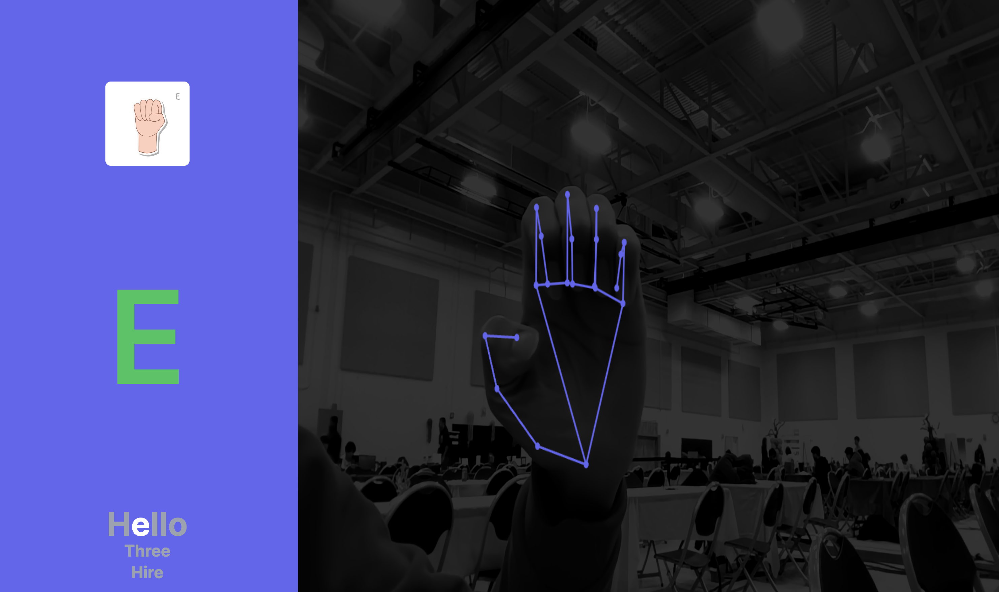

# ASL Learn




## Inspiration
The inspiration behind ASL Learn stems from the desire to make learning sign language more interactive and engaging. We recognized the need for a platform that not only teaches sign language but also provides real-time feedback using image processing models. This innovative approach aims to enhance the learning experience and make it more accessible to a broader audience.

## What it does
ASL Learn is an interactive learning platform designed for sign language education. It utilizes advanced image processing models to assess and verify if users are correctly performing sign language gestures. Users can engage in interactive lessons, receive instant feedback, and track their progress. The platform is not just about learning sign language but also about practicing and mastering but also making it more accessible and fun.

## How we built it
The foundation of ASL Learn is built on image recognition technology. We employed image processing models that can accurately recognize and analyze sign language gestures. The platform incorporates a user-friendly interface for seamless interaction. Using Google's open source media pipe network and creating our own ASL recognition model we were able to combine the two to create the project.

## Challenges we ran into
One of the biggest challenges we ran into was the creation of the model to detect which ASL letter the hand coordinated to. Many of the online pre-trained models were not entirely compatible with the needs of our project, so we had to create our own.

## Accomplishments that we're proud of
Developing ASL Learn came with its set of challenges. One of the primary challenges was fine-tuning the image processing models to achieve high accuracy in recognizing a diverse range of sign language gestures. Additionally, creating a user interface that is both intuitive and visually appealing required iterative design and testing.

## What we learned
The development of ASL Learn provided us with valuable insights into creating and integrating models into web technologies. We gained a deeper understanding of the complexities involved in building image-processing models and successfully integrating them into web technologies.

## What's next for ASL Learn
Looking ahead, the future of ASL Learn involves continuous improvement and expansion. We plan to refine the image processing models further, adding support for more advanced sign language gestures. Additionally, we aim to incorporate features like personalized learning plans, social interactions, and community forums to foster a collaborative learning environment for sign language enthusiasts. The journey of ASL Learn is an ongoing commitment to making sign language education inclusive and effective.


## Run Locally

Clone the project

```bash
  git clone https://github.com/krash3125/asl-learn.git
```

Go to the project directory

```bash
  cd asl-learn
```

Install dependencies

```bash
  npm install --force
```

Run

```bash
  npm run dev
```
